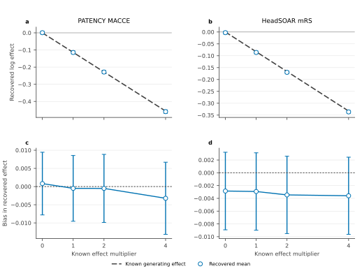
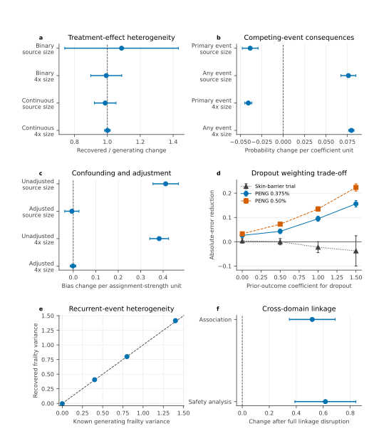
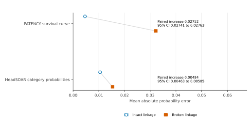

# Mechanism and effect recovery

A simulator may reproduce one fitted dataset while responding incorrectly when
an effect or analysis-relevant mechanism changes. Known treatment effects and
trial mechanisms are therefore varied before their consequences are recovered
with independent analyses. Structure-breaking controls then test whether the
analysis-relevant signal depends on participant linkage.

## Effect recovery

Do independent analyses follow known changes in the generating treatment effect, including no effect?

Dose-response experiments include a null, the source-fitted effect, and two
stronger effects. A separately fitted analysis should move with the generating
value across these settings.

Across the 10-trial RCT portfolio, known treatment and prognostic effects were
varied while source sample sizes and covariate distributions were retained. The
four binary-outcome sources had a treatment-effect unit-scale recovery slope of
0.994 (95% interval 0.937 to 1.052) and a prognostic-effect slope of 0.968
(0.942 to 0.993). Across all 10 sources, median nominal treatment-effect
coverage was 0.96. In the six continuous-outcome sources, the linear
coefficient mapping agreed with the configured scale to numerical precision
(maximum slope deviation from one 2.22e-16).

**Figure 15. Independently fitted effects follow the configured treatment-effect
dose.** Panels a and b compare the mean independently fitted estimate over
1,000 source-size trials with the configured coefficient. Panels c and d show
the corresponding estimation bias; every 95% Monte Carlo interval crosses
zero. The comparison spans the null, source-fitted, and two stronger effects
for Cox and proportional-odds analyses.
[Methods](../METHODS.md#mechanism-recovery) |
[Data](../figures/parameter_recovery.csv)

Across four multiplier settings, the estimated coefficient changed by -0.1150
log hazard-ratio units per multiplier (95% interval -0.1162 to -0.1138) for
PATENCY, compared with a configured change of -0.1141. The HeadSOAR estimate
changed by -0.08341 proportional-odds log odds-ratio units per multiplier
(-0.08369 to -0.08313), compared with a configured change of -0.08321. The
expected ordering was present in all 1,000 paired worlds for both outcomes
(Wilson lower limit 0.996). At the PATENCY null, the mean estimate was 0.00082
(-0.00780 to 0.00944), and nominal 95% interval coverage was 0.963. At the
HeadSOAR null, the mean estimate was -0.00286 (-0.00892 to 0.00321), and
coverage was 0.938. Pairing the four effect settings within each simulated
world isolates the response to the treatment coefficient from otherwise
identical stochastic variation.

The clustered ordinal analysis recovered a coefficient change of -0.4685
(-0.4774 to -0.4596) per multiplier for a configured change of -0.4680. At the
source setting, bias was -0.0013 and robust 95% interval coverage was 0.955
(Wilson interval 0.917 to 0.976).

| Outcome | Multiplier | Generating value | Mean estimate (95% Monte Carlo interval) |
|---|---:|---:|---:|
| PATENCY log hazard ratio | 0 | 0.000 | 0.001 (-0.008 to 0.009) |
| PATENCY log hazard ratio | 1 | -0.114 | -0.115 (-0.124 to -0.106) |
| PATENCY log hazard ratio | 2 | -0.228 | -0.229 (-0.238 to -0.219) |
| PATENCY log hazard ratio | 4 | -0.456 | -0.459 (-0.469 to -0.450) |
| HeadSOAR log odds ratio | 0 | 0.000 | -0.003 (-0.009 to 0.003) |
| HeadSOAR log odds ratio | 1 | -0.083 | -0.086 (-0.092 to -0.080) |
| HeadSOAR log odds ratio | 2 | -0.166 | -0.170 (-0.176 to -0.164) |
| HeadSOAR log odds ratio | 4 | -0.333 | -0.336 (-0.342 to -0.330) |

## Mechanisms

Do independently fitted analyses respond in the expected direction when analysis-relevant trial mechanisms are strengthened or disrupted?

Each experiment changes one analysis-relevant property while retaining the
remaining trial structure. The fitted response then distinguishes three
possibilities: recovery of the configured mechanism, a measurable consequence
for the target analysis, and improved precision when information increases.

**Figure 16. Graded trial mechanisms produce distinct, measurable analysis
responses.**
Panel a gives the change in the fitted treatment-by-age interaction per unit
change in the generating interaction; a slope of 1 means the fitted interaction
changes one-for-one with the configured interaction. Panel b gives the
change in primary-event and any-event probability per unit increase in the
competing-event coefficient. Panel c gives the change in unadjusted and
adjusted treatment-effect bias per unit increase in exposure-assignment
strength. Panel d gives the reduction in absolute treatment-trajectory error
from estimated inverse-probability weighting as lagged-outcome dependence
increases. Panel e compares recovered and configured recurrent-event frailty
variance; the dashed line is identity. Panel f gives the change in
cross-domain association and safety analyses when participant linkage is
fully disrupted. Points in panels a-c and f are equal-source means with 95%
*t* intervals. Panel d uses Monte Carlo intervals over 100 matched trials per
setting. Panel e uses intervals over 15 source studies.
[Methods](../METHODS.md#mechanism-recovery) |
[Figure data](../figures/mechanism_response.csv) |
[Complete operating characteristics](../data/operating_characteristics) |
[Cross-domain portfolio](../data/operating_characteristics/cross_domain_linkage/portfolio_response.csv) |
[Study responses](../data/operating_characteristics/cross_domain_linkage/linkage_response.csv)

Treatment-effect interactions recover the identity response, with narrower
intervals at fourfold information. Raising competing-event intensity lowers
the probability that the primary event occurs first while increasing the
probability of any event. Exposure-assignment strength produces a graded
unadjusted bias response, whereas the correctly adjusted response remains
centred near zero. Recurrent-event frailty follows the configured variance,
and disruption of participant linkage changes both cross-domain analyses in
all eight source studies.

The dropout experiment separates mechanism recovery from correction benefit.
The fitted attendance model recovers the configured lagged-outcome effect in
both source datasets. Estimated weighting produces a graded reduction in
treatment-trajectory error for both PENG contrasts, reaching 0.156 and 0.224
outcome units at the strongest setting. The skin-barrier contrast remains
centred near zero at the two lower settings and becomes negative, with
intervals spanning zero, at the two higher settings. Thus the same generated
dropout mechanism can be recoverable without materially biasing every
treatment contrast.

The skin-barrier design contains 35 participants. At the reference and
stronger dependence settings, weighting moves treatment-slope bias toward zero
but reduces the effective sample fraction to 0.906 and 0.746; median maximum
weights rise to 4.11 and 8.31. The resulting variance increase outweighs the
bias reduction. In the larger PENG design, weighting reduces reference-setting
RMSE from 0.137 to 0.044 and from 0.169 to 0.035 for the two contrasts. The
comparison identifies the information and weight-concentration trade-off that
determines whether correction improves the randomized trajectory analysis.

### Dropout

Longitudinal analyses can be biased when attendance depends on a participant's
previous outcome. Two public longitudinal datasets were used to configure this
relationship at several strengths. The verifier estimated the dropout
coefficient from generated visit records and then compared ordinary
available-case analysis with inverse-probability-of-attendance weighting.

Recovered dropout slopes were 1.044 (1.004 to 1.084) and 0.999 (0.985 to
1.014) per unit configured effect. All eight checks of the generated attendance
probabilities were compatible with the configured model. At the reference
dependence setting, weighting reduced absolute treatment-trajectory error by
0.095 (0.084 to 0.106) and 0.135 (0.126 to 0.144) outcome units for the two
PENG contrasts. The corresponding skin-barrier change was -0.022 (-0.045 to
0.0001). This source-specific contrast identifies when informative attendance
changes the randomized trajectory analysis and when the same attendance
mechanism has little analysis consequence.

### Heterogeneity

The heterogeneity analysis varies how treatment effect changes with age across
the 10 RCT sources. At source size, recovered-versus-configured slopes were
1.086 (0.741 to 1.432) for binary outcomes and 0.987 (0.921 to 1.053) for
continuous outcomes. With four times as much information, the intervals
narrowed to 0.993 (0.899 to 1.087) and 1.000 (0.983 to 1.018). The empirical
standard deviation of the estimates fell to 0.498 (0.472 to 0.526) of its
source-size value, as expected when information is quadrupled.

This comparison separates mechanism recovery from finite-sample precision.
Estimates track the configured effect, while precision improves at the expected
rate when sample size increases.

### Competing risks

The competing-risk experiment generates a primary event and a competing event
within one model. Increasing the competing-event coefficient should both raise
the chance of any event and reduce the chance of observing the primary event
first.

At source size, recovered coefficient slopes were 1.069 (0.993 to 1.145) for
the primary cause and 1.004 (0.916 to 1.092) for the competing cause. Per unit
increase in the competing-cause coefficient, primary-event probability fell by
0.039 (0.029 to 0.048) and any-event probability rose by 0.076 (0.067 to
0.085). At fourfold information, the corresponding coefficient slopes were
1.017 (0.995 to 1.040) and 1.024 (0.984 to 1.064).

### Confounding

The observational experiment assigns exposure through age and body mass index,
then varies the assignment strength in both directions. Stronger assignment
should increase baseline imbalance and bias an unadjusted treatment estimate;
correct adjustment should remove the systematic bias.

At source size, baseline imbalance changed by 0.639 (0.569 to 0.709) and naive
exposure bias by 0.411 (0.355 to 0.468) per unit assignment strength. The
adjusted-bias slope was -0.006 (-0.038 to 0.025). At the strongest assignment,
estimated weighting had absolute risk-difference bias of 0.020 (0.008 to
0.032), falling to 0.011 (0.006 to 0.016) with fourfold information. The
experiment therefore reproduces both the bias mechanism and the expected
benefit and limitation of adjustment under deteriorating overlap.

### Recurrent events

Repeated safety events require participant heterogeneity: some people remain
more event-prone throughout follow-up. Fifteen ImmPort studies, containing
2,628 participants and 15,818 adverse-event rows, provided an external
reference. All 15 showed overdispersion, with an equal-study heterogeneity
median of 0.451 (interval 0.369 to 1.162).

Across configured heterogeneity values from 0 to 1.4, the fitted count analysis
recovered 0.964 units (0.947 to 0.981) per configured unit. A direct check of
the generating law recovered 1.013 (0.986 to 1.040). All 3,750 fits succeeded.
Coverage ranged from 0.939 to 0.989 and null rejection was 0.011 (0.003 to
0.020). The profile-likelihood analysis therefore recovers the graded
heterogeneity while retaining calibrated source-size uncertainty, including
the Poisson boundary.

### Cross-domain linkage

Eight ImmPort studies were also used to test whether assessments, biosamples,
adverse events, and interventions remain attached to the correct participant.
The control progressively permutes these records while preserving every
domain's values exactly.

Complete disruption changed cross-domain association by 0.518 (0.349 to
0.688) and shifted a prespecified safety analysis by 0.616 (0.390 to 0.842)
standardized units. Both responses were positive in all eight studies. This
shows that participant linkage has a measurable analysis consequence even
when every marginal distribution is unchanged.

## Controls

Does breaking analysis-relevant outcome linkage increase source-scale error beyond trial-to-trial sampling variation?

The two controls target the same principle in the source-scale outcome
analyses. Event times are permuted relative to event indicators in PATENCY;
ordinal outcomes are permuted relative to treatment arm in HeadSOAR.

**Figure 17. Breaking trial linkage increases source-scale outcome error.**
The PATENCY control permutes event occurrence relative to follow-up time; the
HeadSOAR control permutes the ordered outcome relative to treatment arm. Each
intact simulated trial is paired with its disrupted counterpart, retaining its
participants, observed values, and sample size. Points are mean absolute
probability errors and bars are 95% confidence intervals over 1,000 trials.
The annotations give the paired mean increase and its 95% confidence interval.
[Methods](../METHODS.md#linkage-preservation) |
[Data](../figures/negative_control.csv)

PATENCY survival-curve error increased from 0.00461 to 0.03213 probability
units, a paired increase of 0.02752 (95% CI 0.02741 to 0.02763). HeadSOAR
category-probability error increased from 0.01049 to 0.01533, a paired increase
of 0.00484 (0.00463 to 0.00505). The fitted high-dose proportional-odds effect
was -0.336 (-0.342 to -0.330) with intact linkage and 0.003 (-0.003 to 0.009)
after arm permutation. Both controls therefore remove the analysis-relevant
signal while preserving the component values.

## Estimation

Separate implementations provide a check against reproducing the same software
error. Across the 10 RCT sources, the maximum difference between
Statsmodels and SciPy treatment coefficients was `2.63e-13`.
Maximum differences were `9.46e-7` for the competing-risk likelihood and
`3.81e-9` for the confounding analysis.

Non-estimable trials were retained. The competing-risk analysis completed
8,854 of 9,000 fits; 145 of its 146 failures occurred at source size because
sparse cause-specific events prevented stable estimation. The confounding
analysis completed 5,984 of 6,000 fits; all 16 failures occurred at source size
because separation or disagreement between independent fits made the
coefficient non-estimable. The heterogeneity, observation, and recurrent-event
analyses completed 5,000, 5,300, and 3,750 fits without failure.
