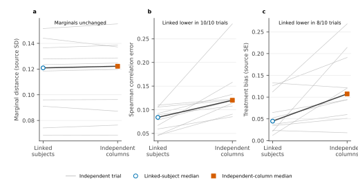

# Participant-linkage preservation

Plausible marginal distributions are insufficient when measurements have been
detached from the participants to whom they belong. This comparison tests
whether preserving complete participant records retains the correlations and
adjusted treatment analyses present in public trial data.

## Linkage preservation

Does keeping each participant's measurements together preserve correlations and adjusted treatment analyses?

Ten public participant-level RCTs compare two plasmode resampling methods.
Linked-subject resampling retains the relationships among a participant's
measurements. Independent-column sampling draws each variable separately,
preserving its distribution while breaking those relationships. The comparison
isolates the contribution of participant linkage to dependence and adjusted
analysis.

**Figure 14. Linked-subject resampling preserves analysis-relevant structure.**
Linked-subject resampling is compared with independent-column sampling across
200 replicates per source and method. The three estimands are standardized
Wasserstein distance, absolute Spearman-correlation error, and absolute
adjusted-treatment bias. Grey lines join the two resampling results for each
source trial; the blue circle and orange square are equal-trial medians. The
paired direction shows what changed while the medians show its typical
magnitude. [Methods](../METHODS.md#linkage-preservation) |
[Summary data](../figures/joint_structure_methods.csv) |
[Trial-level data](../figures/joint_structure_trials.csv)

Median standardized Wasserstein distance was almost identical: 0.121 source
standard deviations for linked-subject resampling and 0.122 for independent
columns. For each trial, Spearman-correlation error was the median absolute
difference between source and simulated correlations among outcome, age, and
body mass index. Its equal-trial median fell from 0.120 to 0.084
correlation-coefficient units, a 30% reduction, and was lower in all 10 trials.
Median absolute bias in the adjusted treatment estimate fell from 0.107 to
0.045 source standard errors, a 58% reduction, and was lower in eight of 10
trials.

A clustered PATENCY analysis reaches the same conclusion through a different
data structure. The simulator retains variable numbers of grafts and
correlated graft outcomes for 2,604 participants. Permuting outcomes across
participant identifiers leaves the outcome distribution unchanged but reduces
within-participant Kendall correlation from 0.2055 to 0.0004.

| Estimand | Independent columns | Linked subject | Relative reduction |
|---|---:|---:|---:|
| Standardized Wasserstein distance, source SD | 0.122 (0.087 to 0.137) | 0.121 (0.091 to 0.137) | 1% |
| Absolute Spearman-correlation error | 0.120 (0.102 to 0.140) | 0.084 (0.057 to 0.106) | 30% |
| Absolute adjusted-treatment bias, source SE | 0.107 (0.060 to 0.191) | 0.045 (0.023 to 0.112) | 58% |
