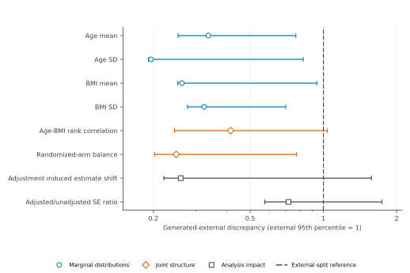
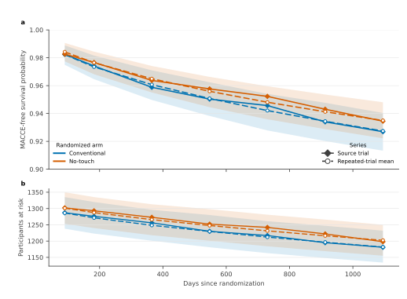
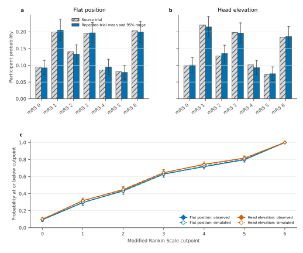
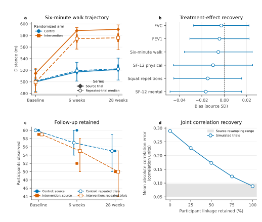

# Source-trial anchoring

External anchoring tests whether generated trials preserve the structures used
by real analyses, not only plausible marginal values. The comparisons therefore
use public participant-level evidence to examine event timing and censoring,
complete ordinal distributions, longitudinal trajectories and dependence, and
adjustment-sensitive trial properties on their corresponding clinical scales.

## External trial distributions

Are marginal, dependence, randomization, and adjustment-sensitive properties within the variation observed between external trials?

The portfolio comparison asks whether generated trial-level properties are
large outliers relative to variation among external randomized trials. It uses
29 external trials for age, body mass index, dependence, and randomized-arm
balance; 10 trials with compatible outcomes also support adjustment-sensitive
analysis properties. The generated comparison contains 75 trials.

For each construct, a standardized distributional distance compares generated
and external trial fingerprints. That distance is divided by the 95th
percentile of distances between independent splits of the external trials. A
ratio of one therefore marks a discrepancy as large as the upper reference
range observed when the external portfolio is compared with itself.

**Figure 10. Point discrepancies fall within the variation among external
trials.** Points are generated-to-external distributional distances divided
by the 95th percentile between external trial splits; horizontal bars are 95%
trial-bootstrap intervals. A point left of the dashed line is a smaller
discrepancy than the 95th percentile obtained when the external trial
portfolio is compared with itself.
Age and body-mass-index moments use 29 external trials. Analysis-impact
constructs use the 10 trials with compatible outcomes. Each external trial is
one independent unit. [Methods](../METHODS.md#external-trial-distributions) |
[Data](../figures/generator_realism.csv)

All eight point ratios are below one. The four marginal-distribution ratios
range from 0.196 to 0.336, with upper interval limits from 0.700 to 0.940.
The age-BMI rank-correlation ratio is 0.416 (95% interval 0.244 to 1.037), and
the randomized-balance ratio is 0.248 (0.202 to 0.776). Adjustment-induced
estimate shift and the adjusted-to-unadjusted standard-error ratio have point
ratios 0.259 and 0.719. Their intervals extend to 1.574 and 1.742 because only
10 external trials support these analysis constructs. Thus the marginal
comparison is bounded below the external reference, while dependence and
analysis-impact estimates are less precise.

## Outcome replication

### Survival

Does simulation reproduce when events occur and how the number at risk changes, rather than only the final event proportion?

The PATENCY analysis asks whether generated trials reproduce the complete
three-year event process. Each of 1,000 simulated trials contains 2,638
participants. The comparison includes arm-specific event-free probability,
the number of participants still at risk, and restricted mean survival time.

**Figure 11. Simulation reproduces event-free survival and its risk-set support
in PATENCY.** Panel a
compares observed arm-specific Kaplan-Meier curves with the mean over 1,000
independently simulated 2,638-participant trials. Panel b gives the number of
participants remaining at risk at the same time points. Solid lines and filled
diamonds are observed; dashed lines and open circles are simulated means.
Shading is the central 95% range across simulated trials, not a confidence
interval for the observed trial. [Methods](../METHODS.md#survival) |
[Data](../figures/outcome_survival.csv)

Mean absolute error in event-free probability was 0.00134. Restricted mean
survival differed by 0.84 days over 1,095 days, and risk-set counts differed by
an average of 4.18 participants per arm-time cell. Agreement therefore extends
from the displayed curve to the changing denominator that supports each point
on that curve. At the source-fitted treatment effect, Cox log-hazard-ratio bias
was -0.00050 (95% Monte Carlo interval -0.00954 to 0.00855), and nominal 95%
interval coverage was 0.962 (Wilson interval 0.948 to 0.972).

At 1,095 days, observed event-free probability was 0.927 in the conventional
arm and 0.934 in the no-touch arm; the corresponding simulation means were
0.927 and 0.935.
[Recovery table](../data/operating_characteristics/outcome_replication/patency_cox_dose_recovery.csv) |
[Restricted mean survival](../data/operating_characteristics/outcome_replication/patency_rmst_predictive.csv)

### Ordinal outcomes

Does simulation reproduce the complete ordered outcome distribution used in the trial analysis?

The HeadSOAR analysis asks whether generation reproduces all seven modified
Rankin Scale categories by randomized arm. This is more demanding than matching
mortality or one favourable-outcome threshold because proportional-odds
analysis uses the complete ordering.

**Figure 12. Simulation reproduces category and cumulative disability
distributions in HeadSOAR.** Panels a and b
compare observed category probabilities with the mean and central 95% range
across 1,000 independently simulated 1,368-participant trials. Panel c gives the
corresponding cumulative probabilities at every modified Rankin Scale cutpoint.
Observed curves use filled diamonds and solid lines; simulated curves use open
circles and dashed lines. The arm-specific category and cumulative
distributions are the probability structure used by the proportional-odds
analysis.
[Methods](../METHODS.md#ordinal-outcomes) |
[Data](../figures/outcome_ordinal.csv)

Across 1,000 trials of 1,368 participants, mean absolute discrepancy was
0.00443 for individual categories and 0.00358 for cumulative probabilities.
Mean absolute discrepancy across five arm-specific safety risks was 0.000330.
At the source-fitted effect, proportional-odds log-odds-ratio bias was -0.00293
(95% Monte Carlo interval -0.00899 to 0.00313), and nominal 95% interval
coverage was 0.947 (Wilson interval 0.931 to 0.959). Agreement is therefore
demonstrated for the complete ordered outcome and its analysis, rather than at
one collapsed threshold.

Observed mortality was 0.203 in the flat-position arm and 0.183 in the
head-elevation arm. The corresponding simulation means were 0.201 and 0.186.
[Recovery table](../data/operating_characteristics/outcome_replication/headsoar_proportional_odds_dose_recovery.csv) |
[Safety outcomes](../data/operating_characteristics/outcome_replication/headsoar_safety_predictive.csv)

### Longitudinal outcomes

Does simulation reproduce change over time and relationships among repeated clinical measurements?

The TERECO analysis asks whether a small longitudinal trial retains change over
time, follow-up patterns, and relationships between repeated measurements. The
source contains 119 randomized participants, three visits, and six linked
clinical outcomes. Two questions are separated: whether the source trial looks
plausible among new trials from the fitted population, and whether treatment
effects remain unbiased when randomization is repeated.

**Figure 13. Repeated trials retain longitudinal trajectories, follow-up, and
participant linkage.**
Panel a compares source-trial arm-by-visit mean six-minute-walk distance with
the medians over 200 independently generated and randomized 119-participant trials;
intervals show the central 50% and 95% simulated-trial ranges. Panel b reports
treatment-effect bias for all six outcomes in source-standard-deviation units;
bars are simultaneous 95% intervals across outcomes. Panel c compares the
source-trial number of participants at each visit with the repeated-trial median and
central 95% range. Panel d progressively restores participant linkage and
measures error across all 135 within- and between-outcome correlations; the
grey band is the 95% participant-resampling range from the source trial. The
four panels test trajectory scale, randomized treatment analysis, changing
follow-up, and multivariate dependence.
[Methods](../METHODS.md#longitudinal-outcomes) |
[Trajectory data](../figures/outcome_longitudinal.csv) |
[Treatment recovery](../data/operating_characteristics/longitudinal/tereco_treatment_recovery.csv) |
[Linkage response](../data/operating_characteristics/longitudinal/tereco_linkage_response.csv)

For the displayed six-minute-walk outcome, the six source means all lie within
their repeated-trial 95% predictive intervals. The average absolute difference
between a source mean and the repeated-trial median is 8.00 metres, or less than
one tenth of the source standard deviation; the maximum is 15.07 metres. The
largest differences occur in the intervention arm because the single source
trial has a chance baseline imbalance. Independent re-randomization correctly
centres that imbalance around zero rather than carrying it forward as a
treatment effect.

| Arm | Visit | Observed mean, m | Simulation median, m | Absolute difference, m |
|---|---|---:|---:|---:|
| Control | Baseline | 499.98 | 501.19 | 1.22 |
| Control | 6 weeks | 517.07 | 519.24 | 2.17 |
| Control | 28 weeks | 521.38 | 522.50 | 1.12 |
| Intervention | Baseline | 514.52 | 499.45 | 15.07 |
| Intervention | 6 weeks | 588.40 | 574.60 | 13.80 |
| Intervention | 28 weeks | 590.58 | 575.98 | 14.60 |

Across all six outcomes and all arm-visit cells, all 36 source means and all 36
source follow-up counts lie within their repeated-trial 95% predictive
intervals. The median absolute follow-up-count error is one participant. The
largest absolute treatment-effect bias is 0.016 source standard deviations, all
simultaneous 95% bias intervals include zero, and interval coverage ranges from
0.940 to 0.965. Mean absolute
correlation-coefficient error fell from 0.289
(95% interval 0.287 to 0.291) after independent-outcome generation to 0.088
(0.087 to 0.091) with complete participant linkage. The latter lies within the
source-resampling range of 0.051 to 0.096. Correlation-vector alignment reaches
0.862 and 99.2% of materially non-zero correlations have the correct sign. The
graded response distinguishes
joint-distribution recovery from marginal agreement at one selected setting.
