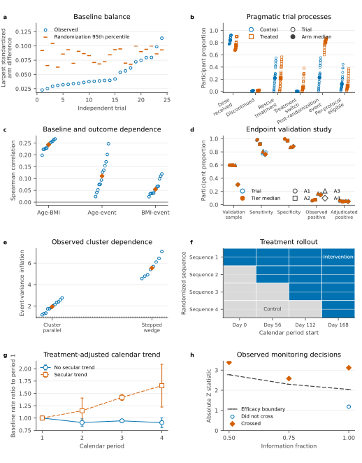
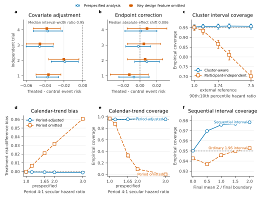
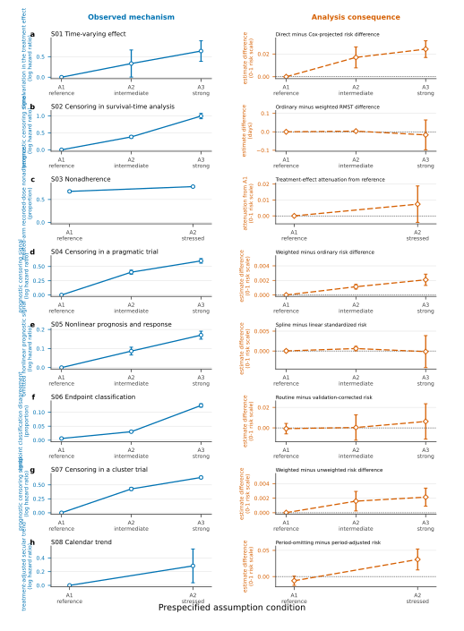
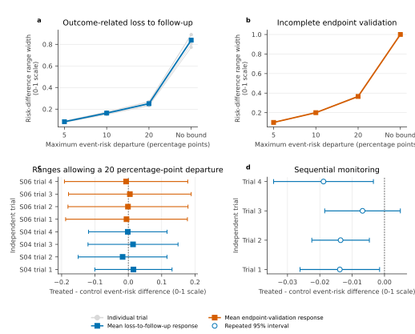

# Trial design and assumption response

The declared design and assumption conditions matter only if they are visible
in the released records and change the supported analysis in the expected way.
The comparisons below first recover each design feature, then omit or strengthen
it to test its analytical consequence. Where a routine analysis fails, the
prespecified alternative must still answer the same treatment question.

## Design properties

Are the declared trial designs visible in the released participant, endpoint, and protocol records?

The Design axis identifies the statistical structure of the trial. Its seven
profiles cover individual randomization, pragmatic conduct, structured
covariates, endpoint ascertainment, cluster randomization, stepped-wedge
rollout, and interim monitoring. Each property below is recovered from the
released participant, endpoint, or protocol records.

| Profile | Design question | Discriminating comparison | What the evidence establishes |
|---|---|---|---|
| DP01 | Did individual randomization produce plausible baseline balance? | Observed maximum prognostic-covariate imbalance versus the trial-specific randomization distribution | The complete census follows its randomization reference, including two expected tail realizations. |
| DP02 | Does treatment assignment lead to distinct exposure and post-randomization histories? | Exposure received, intercurrent events, and per-protocol eligibility | Assignment, exposure, post-randomization conduct, and analysis eligibility remain distinct; these observables do not identify a causal per-protocol effect. |
| DP03 | Does baseline prognostic structure enter the analysis as intended? | Covariate-standardized versus unadjusted risk difference, followed by the A1-A3 model-form response | Adjustment gives a small efficiency gain in the finite A1 trials; the graded response establishes when a linear outcome model is inadequate. |
| DP04 | Does imperfect endpoint ascertainment change the result? | Validation-corrected versus routinely observed endpoint analysis | Misclassification is visible and correction changes the finite-trial estimate. The repeated-trial analysis below establishes interval performance. |
| DP05 | Is cluster-level dependence present and inferentially consequential? | Cluster-aware versus participant-independent uncertainty | Event dependence rises with cluster heterogeneity, and cluster-aware intervals retain coverage where participant-independent intervals do not. |
| DP06 | Can treatment be separated from calendar time during staggered adoption? | Period-adjusted versus period-omitting analysis, with and without secular trend | Period adjustment separates treatment from staggered adoption; omission produces graded bias and undercoverage as the secular trend strengthens. |
| DP07 | Does the monitoring plan control false rejection and stop earlier as the signal strengthens? | Null and graded-signal operating characteristics plus independent replay at the actual look | The plan controls null rejection, gains power and earlier stopping with signal, and reproduces every released monitoring decision. |

**Figure 3. Each trial-design mechanism is visible in released records.**
Panel a compares the largest standardized difference across five prespecified
prognostic covariates with its 95th percentile under 499
arm-count-preserving random reassignments. Panel b reports exposure received,
post-randomization events, and per-protocol eligibility by randomized arm
across all 24 pragmatic trials. Panel c shows participant-level prognostic
correlations. Panel d
reports validation sampling, classification performance, and observed and
adjudicated event rates by ascertainment tier. Panel e reports the event
variance inflation recovered separately in each cluster-parallel and
stepped-wedge trial; one denotes participant-independent outcomes. Panel f
shows the four randomized treatment-adoption sequences. Panel g compares
treatment-adjusted calendar-period event rates with and without the generated
secular trend; bars are 95% *t* intervals over four independent trials. Panel h
compares each released absolute test statistic with the prespecified efficacy
boundary at its actual information fraction. Open blue points are individual
trials and orange symbols are finite-census medians in panels c-e. Colour
identifies randomized arm and marker shape in panel b, where filled symbols
are arm medians; panel d uses tier-specific shapes and distinguishes individual
trials from tier medians by fill. These measurements establish the participant, cluster,
calendar-time, and monitoring structures supplied to the corresponding
analyses.
[Methods](../METHODS.md#design-properties) |
[Tidy properties](../data/design_properties.csv) |
[Canonical result](../data/design_characterisation.json)

Observed baseline imbalance lies below the trial-specific randomization 95th
percentile in 22 of 24 trials. The two exceedances are at the 98.2nd and 99.2nd
percentiles. Under 24 independent complete randomizations, the probability of
at least two 95th-percentile exceedances is 0.339. Across the 24
pragmatic trials, median exposure received is 0.839 in the control arm and
0.757 in the treated arm. Median rescue use is similar (0.220 and 0.217),
whereas switching is absent in control and has median 0.063 in treated
participants. Any recorded intercurrent event occurs in median proportions
0.228 and 0.813, and per-protocol eligibility is 0.118 and 0.090. These
quantities separate assigned treatment, received treatment, post-randomization
events, and the strict per-protocol subset.

In the 12 covariate-structure trials, the median age-BMI rank correlation is
0.244, compared with 0.111 for age-event and 0.055 for BMI-event dependence.
The 16 ascertainment trials validate a median 0.597 of participants; median
sensitivity and specificity are 0.871 and 0.928. Median observed and
adjudicated event proportions are 0.108 and 0.050. All eight stepped-wedge
trials contain four cluster adoption sequences spanning 168 days. Four
group-sequential trials are observed at information fractions 0.50, 0.75, or
1.00; two stop before the final look, and all four stop decisions are
independently reproduced.

Cluster event dependence is visible in every clustered trial. In the 12
cluster-parallel trials, the arm-residualized event intraclass correlation has
median 0.0114 (range 0.0019 to 0.0169), with a one-way event
variance-inflation factor of 1.95 (1.20 to 2.76). Across the eight
stepped-wedge trials, the corresponding values are 0.0285 (0.0199 to 0.0415)
and 5.54 (4.57 to 7.07). These measurements quantify realised endpoint
information rather than inferring dependence from cluster identifiers.

The repeated-world experiment calibrates this scale at the 3.5% event risk
used by the cluster trials. The empirical-reference log-hazard standard deviation
targets the adjusted median intraclass correlation of 0.011 reported across
55 primary-care trial outcomes ([sources](../SOURCES.md)). This corresponds to a
90th-to-10th percentile cluster hazard ratio of 3.74. The recovered mean event
intraclass correlation is 0.0105 (95% interval 0.0102 to 0.0108), and the mean
event design effect is 1.883 (1.859 to 1.908), compared with 0.991 (0.981 to
1.001) under zero cluster heterogeneity. Increasing the same mechanism to
hazard ratios of 5.00 and 7.50 raises the mean design effect to 2.451 and
3.669. This response shows how the cluster-effect parameter changes event
information before its inferential consequence is evaluated in Figure 4.

Under the released three-look monitoring plan, the independently simulated
null rejection probability is 0.0497 (95% interval 0.0491 to 0.0503).
Rejection by the final look rises from 0.170 when the mean final statistic is
half its final boundary to 0.981 when it is twice the boundary. The
corresponding probabilities of stopping before the final look are 0.083 and
0.895. The response demonstrates both false-positive control and the intended
gain in early stopping as the treatment signal strengthens.

What changes when an analysis omits an encoded trial-design feature?

Within-trial analyses use randomized participants or clusters. The monitoring
experiment uses an independent trial path and evaluates coverage of the
standardized treatment signal at the realized analysis look.

**Figure 4. Trial-design features have measurable analytical consequences.**
Points and bars in panels a and b are treated-minus-control event-risk
differences and 95% confidence intervals. Panels a and b compare prespecified
covariate adjustment and endpoint correction with analyses omitting those
features. Panel c compares cluster-aware and participant-independent interval
coverage across 1,000 trials at each cluster intensity. Panels d and e show
bias and coverage for calendar-period-adjusted and period-omitting
stepped-wedge analyses across 1,000 trials at each secular-trend intensity.
Panel f shows coverage
of the standardized treatment signal by the repeated confidence interval and
an ordinary 1.96 interval across 500,000 independent monitoring paths; the
dashed line marks 95%. Participants are the independent units in panels a and
b; randomized clusters are the units in panels c-e. The empirical cluster
reference in panel c and the prespecified secular-trend setting in panels d
and e are marked on the horizontal axes.
[Methods](../METHODS.md#design-properties) |
[Paired estimates](../data/design_comparisons.csv) |
[Cluster operating characteristics](../data/operating_characteristics/clustered_design/cluster_response_summary.csv) |
[Stepped-wedge operating characteristics](../data/operating_characteristics/stepped_wedge/stepped_wedge_response_summary.csv) |
[Monitoring operating characteristics](../data/operating_characteristics/group_sequential/group_sequential_operating_characteristics.csv)

Covariate adjustment changes the risk difference by 0.0003 to 0.0011
probability units; the median adjusted-to-unadjusted interval-width ratio is
0.950. Adjustment
therefore leaves the randomized contrast essentially unchanged and provides a
small efficiency gain in this release. The A1-A3 model-form response in Figure
5, rather than this modest A1 comparison, tests whether the generated
prognostic structure requires a more flexible analysis. Endpoint
correction changes the risk difference by 0.0021 to 0.0074 probability units,
with median absolute shift 0.0060 and median corrected-to-observed
interval-width ratio 0.766. In stepped-wedge trials, the median adjusted-unadjusted
shift is 0.0066 without secular trend and 0.0275 with secular trend. The
stress condition therefore increases the median analytical consequence
4.2-fold. The treatment-adjusted baseline log-rate slope is -0.026 per rollout
period (95% interval -0.066 to 0.014) without secular trend and 0.170 (0.102 to
0.238) with secular trend. The latter corresponds to a geometric rate ratio of
1.67 from the first to fourth rollout period. The no-trend trials therefore
serve as a specificity comparison: period adjustment has little consequence
when background risk is stable, but materially changes the result when
calendar time and staggered adoption are associated.

Across the cluster-intensity response, cluster-aware coverage remains between
0.953 and 0.958. Participant-independent coverage falls from 0.951 without
heterogeneity to 0.866 at the empirical-reference intensity and 0.701 under the
strongest stress. At the empirical-reference intensity, risk-difference bias is -0.00025 probability
units (95% interval -0.00063 to 0.00013). The comparison establishes that the
cluster-aware interval responds to within-cluster dependence while retaining
the same risk-difference estimator.

The stepped-wedge response reaches the same conclusion over 1,000 matched
trials at each of five trend intensities. At the prespecified
period-4-to-period-1 hazard ratio of 1.65, period-adjusted risk-difference bias
is -0.00070 probability units (95% interval -0.00150 to 0.00011), with
coverage 0.957 (0.943 to 0.968). Omitting period produces bias 0.0211
(0.0205 to 0.0216) and coverage 0.330 (0.302 to 0.360). At the strongest
trend, adjusted coverage is 0.956 while period-omitting coverage is zero.
Calendar-period adjustment therefore separates the treatment effect from
staggered adoption across the full tested response, rather than only in the
finite release.

Under sequential monitoring, repeated-interval coverage is 0.950 under the
null and ranges from
0.970 to 0.978 at positive signals. The ordinary interval covers 0.943 under
the null. At a mean final statistic equal to the final efficacy boundary, the
realized-look estimate has upward bias of 0.178 standardized units (95%
interval 0.174 to 0.181), while repeated-interval coverage is 0.976. At twice
the boundary, mean information falls to 0.640 of the fixed-horizon maximum.
These results separate the expected estimation consequence of optional
stopping from error control and information efficiency.

## Assumption response

Are analysis-relevant mechanisms visible, and does the corresponding analysis result respond as each mechanism strengthens?

The Assumption axis changes one analysis-relevant mechanism while retaining
the design, estimand, analysis scale, sample size, follow-up, and generated
trial. Eight series compare A1-A3 or A1-A2 tiers over 32 matched trials per
series.
Each analysis recovers a mechanism-specific quantity from public records and
compares the routine route with a prespecified alternative for the same
estimand.
Figure 5 retains each mechanism in its native diagnostic unit. The analytical
consequence is a signed, prespecified contrast between two analyses of the
same estimand, expressed in days for restricted mean survival time and on the
0-1 event-risk scale for risk differences. Positive values have a
series-specific interpretation stated above each panel, such as direct minus
Cox-projected risk or period-omitting minus period-adjusted risk. The
treatment-policy series instead shows attenuation of the same randomized-arm
effect from its A1 reference as adherence falls. The treatment effect itself
is reported separately for each trial.

| Series | What changes in the trial | Analysis comparison | Question answered |
|---|---|---|---|
| S01 | The treatment effect changes over follow-up | Constant-effect Cox risk versus Kaplan-Meier risk | Does imposing one hazard ratio over time change the treatment-risk estimate? |
| S02 | Censoring becomes more prognostic | Ordinary versus censoring-weighted restricted mean survival | Does outcome-related loss to follow-up change the estimated survival-time difference? |
| S03 | Treatment nonadherence increases | The same treatment-policy Kaplan-Meier analysis in both roles | Does adherence alter an analysis that deliberately targets treatment assignment? |
| S04 | Censoring depends more strongly on baseline prognosis | Ordinary versus baseline-covariate-weighted Kaplan-Meier risk | Does accounting for observed predictors of loss to follow-up change the treatment-risk estimate? |
| S05 | Baseline prognosis becomes nonlinear | Linear versus spline-based standardized survival risk | Does a flexible prognostic model change the standardized treatment contrast? |
| S06 | Routine endpoint classification disagrees more often with adjudication | Routine-endpoint Kaplan-Meier risk versus a validation-corrected analysis | Does endpoint error change the treatment-risk estimate? |
| S07 | Prognostic censoring is shared within randomized clusters | Cluster-weighted Kaplan-Meier risk with and without censoring weights | Does clustered outcome-related loss to follow-up change the treatment-risk estimate? |
| S08 | Background event risk changes during staggered treatment rollout | Unadjusted Kaplan-Meier risk versus period- and cluster-adjusted risk | Can the treatment effect be separated from calendar time? |

**Figure 5. Generated mechanisms strengthen across assumption tiers and reveal
when the prespecified alternative matters.** Each panel is one assumption series.
Blue circles use the left axis and show the mechanism measured from public
trial records in its stated unit. Orange diamonds use the right axis and show
the signed analysis contrast named above that panel; S03 instead shows
treatment-effect attenuation from its A1 reference. The unit is days for
restricted mean survival time and the 0-1 event-risk scale for every
risk-difference analysis. S03 and S08 have two prespecified tiers; the
remaining series have reference, intermediate, and strong conditions.
Bars are 95% Student *t* intervals across 32 matched generated trials.
Adjacent-tier changes use paired intervals reported in the linked contrast
table. The nonadherence series targets a treatment-policy estimand, so its
routine and alternative analyses are identical by design.
[Methods](../METHODS.md#assumption-response) |
[Native-unit results](../figures/assumption_response.csv) |
[Matched-world bridges](../data/assumption_response/assumption_bridges.csv) |
[Tier summaries](../data/assumption_response/assumption_summaries.csv) |
[Paired contrasts](../data/assumption_response/assumption_paired_contrasts.csv) |
[Matched design](../data/assumption_response/matched_assumption_design.json)

All 14 adjacent tier comparisons increase the observed mechanism, and every
95% paired interval excludes zero. The time-varying-effect diagnostic rises
from 0.000 to 0.333 and 0.637 log-hazard-ratio units. Endpoint disagreement
rises from 0.006 to 0.030 and 0.124 of participants. In the repaired
cluster-censoring series, the prognostic-censoring signal rises from 0.000 to
0.427 and 0.633 log-hazard-ratio units; the A2-to-A3 paired change is 0.206
(95% interval 0.196 to 0.216).

The routine-alternative analysis gap increases in 13 of the 14 adjacent
comparisons. Six paired intervals exclude zero, including both time-varying
effect comparisons, dependent censoring from A1 to A2, nonlinear prognosis
from A2 to A3, clustered censoring from A1 to A2, and secular trend. The
largest analytical consequences occur for time-varying effects and secular
trend. At the strongest displayed tiers, their mean estimate gaps are 1.42
(95% interval 1.05 to 1.79) and 2.53 (1.02 to 4.04) times the larger reported
standard error. The prognostic-censoring gap is 0.025 (0.000 to 0.050) on the
same scale despite a clear increase in its diagnostic mechanism. The
nonadherence comparison is exactly zero because both routes estimate the
prespecified treatment-policy effect. All 88 matched analyses completed, and
the independently replayed supported estimates agree with their distributed
references to machine precision.

What result remains supported when an A4 condition makes the routine point analysis incompatible with the trial question?

The estimand is the treated-minus-control event-risk difference at the prespecified horizon. The comparison uses identified ranges for dependent censoring and incomplete endpoint-validation support; repeated intervals after group-sequential monitoring. Uncertainty is represented by the complete identified range for nonpoint conclusions; repeated 95% confidence interval for group-sequential point conclusions.

An A4 condition is not a stronger point on the A1-A3 scale. It means that the
prespecified conventional analysis is not defensible. Identification is a
separate question: it determines whether the supported replacement is a point
estimate, an identified range, or a stated limitation. Here, incomplete
follow-up or validation support requires a range, whereas data-dependent
analysis timing requires the prespecified repeated analysis.

| Series | Why the conventional analysis is incompatible | Supported conclusion |
|---|---|---|
| S04 | Loss to follow-up depends on an outcome-related factor that is not measured in the released baseline data. | Report the fixed-horizon risk-difference range under each prespecified event-risk departure limit, including the unrestricted worst case; do not present an ordinary Kaplan-Meier point estimate as identified. |
| S06 | Endpoint-validation data do not support transport of sensitivity and specificity to every required prognostic stratum. | Report the adjudicated-endpoint risk-difference range under each prespecified validation-transport departure limit, including the unrestricted worst case; do not extrapolate a point correction into unsupported strata. |
| S09 | The analysis occurs at a data-dependent interim look selected by the monitoring plan. | Report the group-sequential risk difference and repeated confidence interval at the realized information fraction; do not substitute an ordinary fixed-look interval. |

**Figure 6. A4 conditions change the form of the supported statistical
conclusion.** Panels a and b show how the risk-difference range widens as the
allowed event-risk departure increases from 5 to 20 percentage points
and then becomes unrestricted. Thin lines represent independent trials and
the square-marked line is their mean. Panel c shows each trial's range at the
prespecified 20 percentage-point departure limit; the square marks the range midpoint only
for visual placement and is not a point-identified estimate. Panel d shows
the group-sequential point estimate and repeated 95% confidence interval at
each trial's realized analysis look. The vertical line marks no treatment
difference. All panels use the treated-minus-control event-risk scale, and
identified ranges are not interpreted as confidence intervals.
[Methods](../METHODS.md#assumption-response) |
[Trial-level results](../data/assumption_response/assumption_bridges.csv) |
[Identified ranges](../data/assumption_identification_results.csv) |
[Cell summaries](../data/assumption_response/assumption_summaries.csv)

The TrialEval base-trial census supplies this finite check over 100 trials.
Across the census, every supported A1-A4 analysis replays with a maximum absolute
discrepancy of 5.1 x 10-14.
[Finite trial-level bridges](../data/assumption_bridges.csv) |
[Finite cell summaries](../data/assumption_summaries.csv) |
[Finite result](../data/assumption_characterisation.json)
