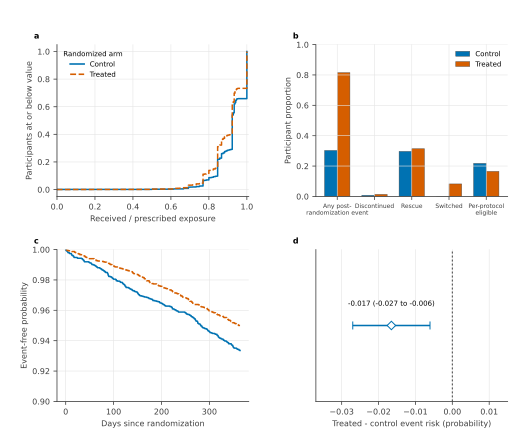
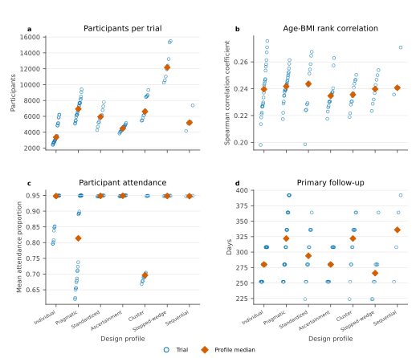
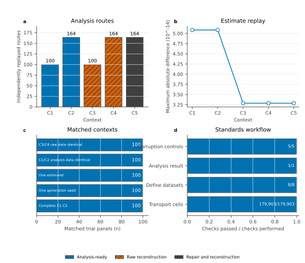

# TrialEval release contents

TrialEval fixes the treatment question while varying the design, assumptions,
and information available for analysis. The evidence must therefore establish
that each base trial is coherent, that the release spans the declared trial
properties, and that its five matched contexts change the analysis task without
changing the estimand.

## Study design

Clinical-trial analyses depend on correlations, follow-up, censoring, competing
events, repeated measurements, and participant-level linkage. Simulation must
therefore preserve these properties alongside each variable's distribution.

The validation follows four linked steps:

1. **Characterisation:** one released trial is followed from participant
   records to its treatment-effect estimate, then all independent trials are
   described using the same variables and estimators.
2. **Replication:** generated trials are compared with public source trials on
   the clinical scales used in their analyses.
3. **Intervention:** one feature of the data-generating process is varied while
   the rest of the trial is held fixed.
4. **Recovery:** an independent statistical implementation estimates the
   changed feature from the generated data.

The release characterisation covers 100 independent trials comprising 610,190
synthetic participants and 500 matched context views. External analyses cover
10 participant-level randomized trials, three detailed source-trial outcome
studies, 15 recurrent-event studies, and eight cross-domain clinical studies.
The survival, ordinal, and cluster analyses use 1,000 simulated trials at each
tested setting. Other source-specific and broader mechanism analyses use 50 to
200 trials per setting and treat the source trial or study as the unit for
cross-source uncertainty. The sequential-monitoring experiment uses 500,000
independent trial paths per signal level.

## Trial questions

The nine trial families separate a clinical question from the statistical
assumption needed to answer it. Each family includes a positive condition in
which the relevant mechanism is present and a negative condition in which it
is absent or cannot be supported. A useful simulator must distinguish both.

| Family | Trial question | Positive evidence | Negative or specificity evidence | Analysis consequence |
|---|---|---|---|---|
| Time-varying treatment effect | Does treatment benefit change during follow-up? | A treatment-by-time diagnostic detects the change, and a direct fixed-horizon Kaplan-Meier contrast remains available. | Under proportional hazards, the diagnostic is centred near zero and the Cox and Kaplan-Meier contrasts agree. | A constant-effect Cox model diverges from the fixed-horizon risk contrast as time variation increases. |
| Prognostic censoring and survival time | Does loss to follow-up depend on prognosis when treatment effects also vary by prognosis? | Baseline prognosis predicts both outcome and follow-up; inverse-censoring-weighted restricted mean survival recovers the treatment contrast. | With prognosis-independent censoring, ordinary and weighted restricted mean survival agree. | Ordinary restricted mean survival becomes biased as prognostic selection increases, while the weighted analysis retains coverage. |
| Pragmatic treatment use | Does treatment assignment remain the target when adherence, rescue, and switching vary? | Treated-arm recorded-dose adherence and post-randomization treatment histories change visibly by trial condition. | The same analysis retains every randomized participant in both conditions; no adherence-defined subgroup is introduced. | Reduced adherence can attenuate the treatment-policy effect without changing either the randomized treatment question or its analysis population. |
| Baseline-dependent censoring | Does measured baseline prognosis affect observation of the primary endpoint? | Baseline predictors explain follow-up, and censoring-weighted risk estimation corrects the resulting selection. | With independent censoring, ordinary and weighted risk estimates agree. | The ordinary risk contrast loses coverage as measured dependent censoring strengthens. |
| Nonlinear prognosis | Is a linear prognostic model adequate for covariate-standardized risk? | Prespecified functional-form diagnostics detect curvature, and spline standardization recovers the risk contrast. | With linear prognosis, linear and spline standardization agree within sampling variation. | Linear standardization becomes biased as curvature and treatment-effect modification strengthen. |
| Endpoint validation | Does routine endpoint classification preserve the treatment contrast? | Validation data identify stratum-specific sensitivity and specificity, and the corrected analysis recovers adjudicated-endpoint risk. | With accurate, transportable classification, routine and validation-corrected analyses agree. | Routine-endpoint analysis attenuates the contrast as classification error increases; unsupported validation strata require an identified set rather than a point correction. |
| Cluster-dependent follow-up | Does prognosis-related loss to follow-up operate within randomized clusters? | Cluster and prognostic effects are visible in follow-up, and cluster-aware censoring weights recover the risk contrast. | With independent follow-up, weighted and unweighted cluster analyses agree. | Ignoring informative follow-up produces bias; ignoring clustering understates uncertainty. |
| Stepped-wedge rollout | Can treatment be separated from calendar time during staggered adoption? | Event risk changes by rollout period, and a period-adjusted cluster analysis recovers the treatment contrast. | Without a secular trend, adjustment has little effect and both routes recover the contrast. | Omitting calendar period creates graded bias and undercoverage as the trend strengthens. |
| Sequential monitoring | Does the monitoring plan control false rejection while allowing early stopping? | Rejection and early stopping increase with the treatment signal, and repeated confidence intervals retain coverage at the realized look. | Under the null, rejection remains at the prespecified error rate. | An ordinary fixed-look interval does not account for selection of the analysis time; the repeated interval does. |

## Analysis choices

Each family holds its estimand fixed while testing whether the analysis
responds correctly to the observed trial structure. An alternative is retained
only when it answers the same treatment question and its assumptions are
supported by the supplied data and design.

| Family | Primary estimand | Routine analysis or control | Prespecified supported analysis | Route not supported |
|---|---|---|---|---|
| Time-varying treatment effect | Marginal treated-minus-control death-risk difference at the fixed horizon in all randomized participants | Cox model projected to fixed-horizon risk | Direct arm-specific Kaplan-Meier risk when treatment effects vary over time | The Cox projection after material failure of its constant-effect representation |
| Prognostic censoring and survival time | Marginal treated-minus-control restricted mean survival-time difference through the fixed horizon | Ordinary Kaplan-Meier restricted mean survival | Baseline-covariate inverse-censoring-weighted restricted mean survival when measured prognosis predicts follow-up | The ordinary analysis under material measured prognostic censoring |
| Pragmatic treatment use | Treatment-policy marginal death-risk difference at the fixed horizon in all randomized participants | Kaplan-Meier by randomized arm in the higher-adherence condition | The same randomized-arm analysis when adherence, rescue, and switching increase, accompanied by exposure and intercurrent-event summaries | Conditioning the primary analysis on adherence, rescue, switching, or discontinuation, which changes the treatment-policy question |
| Baseline-dependent censoring | Treatment-policy marginal death-risk difference at the fixed horizon in all randomized participants | Kaplan-Meier by randomized arm | Baseline-covariate inverse-censoring-weighted Kaplan-Meier; an identified set when dependent censoring is not identified from observed predictors | An unsupported point estimate when the observation process is not identified |
| Nonlinear prognosis | Risk difference standardized to randomized participants with baseline BMI at least 35 kg/m2 | Linear Cox g-computation | Restricted-cubic-spline Cox g-computation when prespecified functional-form tests show material curvature | An unstandardized contrast, a changed target population, or the linear model after material model-form failure |
| Endpoint validation | Marginal adjudicated-endpoint death-risk difference at the fixed horizon in all randomized participants | Kaplan-Meier using the routinely recorded endpoint | Constrained validation likelihood with stratum-preserving bootstrap; an identified set when validation support is incomplete | Routine-endpoint inference under material classification error, or point correction requiring unsupported transport |
| Cluster-dependent follow-up | Participant-average marginal death-risk difference at the fixed horizon | Participant-weighted, cluster-aware Kaplan-Meier | Cluster-aware baseline-covariate censoring weighting when measured prognosis predicts follow-up | Participant-independent uncertainty or unweighted analysis under material prognostic censoring |
| Stepped-wedge rollout | Period-adjusted participant-average marginal death-risk difference under randomized staggered adoption | Period-omitting analysis used only as a design-naive control | Calendar-period-, exposure-timing-, and cluster-adjusted analysis with period-pattern diagnostics | The period-omitting control for primary inference, because it conflates intervention exposure with calendar time |
| Sequential monitoring | Marginal death-risk difference at the fixed horizon under the realized monitoring look | Ordinary fixed-look Kaplan-Meier interval | Repeated inference using the prespecified information fraction and spending boundary | A fixed-final 1.96 interval after the analysis look has been selected by repeated monitoring |

The mechanism, participants, endpoint, and estimand are identical across the
five context views of a matched trial. C1 and C3 prescribe one analysis and
therefore test implementation with analysis-ready and source-domain data.
C2, C4, and C5 require selection from the complete supported same-estimand
set; C4 adds reconstruction and C5 adds repair of one declared duplicate.
Comparing these contexts tests whether the appropriate analysis can be
selected and executed as information is removed from the specification or
added to the data-preparation task.

## Released trials and contexts

### Worked TrialEval example

Do treatment exposure, post-randomization events, follow-up, and the stated analysis form one coherent trial?

The worked trial is a pragmatic, individually randomized time-to-event study
with 7,691 participants. Its public participant table links one-to-one to 7,691
primary endpoint rows. The analysis population is intention to treat, the
estimand uses a treatment-policy strategy, and the prespecified Kaplan-Meier
analysis estimates the treated-minus-control event risk at 365 days.

**Figure 1. Exposure, follow-up, and outcome records form one coherent
pragmatic trial.**
Panel a shows the participant distribution of exposure received relative to
exposure prescribed. Panel b shows the proportions with an intercurrent event,
treatment discontinuation, rescue therapy, treatment switching, and
per-protocol eligibility. Panel c gives the arm-specific Kaplan-Meier
event-free curves. Panel d gives the independently reproduced 365-day risk
difference and 95% confidence interval. Blue and orange identify the control
and treated arms; line pattern also distinguishes them in panels a and c.
[Methods](../METHODS.md#trialeval-release-characterisation) |
[Participant data](../data/worked_trial_participants.csv) |
[Trial estimates](../data/worked_trial.csv) |
[Analysis lineage](../data/worked_trial_lineage.json)

The control and treated arms contain 3,846 and 3,845 participants. Mean age is
34.22 and 34.15 years, and mean exposure received is 0.921 and 0.902 of
exposure prescribed. Intercurrent events occur in 0.302 of control
participants and 0.814 of treated participants. Most records reflect
nonadherence or rescue therapy; treatment switching contributes only in the
treated arm. There are 255
control-arm and 192 treated-arm events. The treatment-policy risk difference
is -0.0165 probability units (95% CI -0.0270 to -0.0060).

### TrialEval base-trial census

What range of trial properties is present across the release?

The five contexts are alternative evidence views of the same scientific trial,
not additional simulated trials. The complete census therefore begins with
the 100 C1 analysis-ready trials and attaches the other four contexts by
matched-set identity. Each independent trial contributes once to the
base-trial display.

**Figure 2. The release spans seven distinct design profiles.** Open circles are
independent trials and orange diamonds are profile medians. Panel a gives the
trial sample size. Panel b gives the overall participant-level Spearman
correlation between age and body mass index. Panel c gives mean participant
attendance. Panel d gives the declared primary follow-up duration. The complete
census retains both routine and stressed settings. [Methods](../METHODS.md#trialeval-release-characterisation) |
[Profile data](../data/programme_profiles.csv) |
[Estimate data](../data/programme_estimates.csv) |
[Canonical result](../data/release_characterisation.json)

| Profile | Design | Trials | Participants per trial | Median attendance | Follow-up, days |
|---|---|---:|---:|---:|---:|
| DP01 | Individual randomized | 24 | 2,405-6,216 | 0.948 | 252-308 |
| DP02 | Pragmatic | 24 | 5,062-9,394 | 0.814 | 252-392 |
| DP03 | Covariate structure | 12 | 4,267-7,811 | 0.948 | 224-364 |
| DP04 | Endpoint ascertainment | 16 | 3,830-5,176 | 0.949 | 252-308 |
| DP05 | Cluster parallel | 12 | 5,454-9,322 | 0.696 | 224-364 |
| DP06 | Stepped wedge | 8 | 10,236-15,499 | 0.948 | 224-364 |
| DP07 | Group sequential | 4 | 4,138-7,380 | 0.948 | 252-392 |

The age-BMI rank correlation is stable across profiles: profile medians range
from 0.235 to 0.244 correlation-coefficient units. Attendance separates the
pragmatic and cluster-parallel stress settings, whose profile medians are 0.814
and 0.696, from profiles centred near 0.948. Primary follow-up spans 224 to 392
days across the base-trial census. These quantities describe the scale, dependence,
observation, and duration of the data presented for analysis.

## Context and standards

Does each information context preserve the trial and estimand while changing the declared analysis input or reconstruction task?

The Context axis changes the information supplied for analysis, not the
generated trial. C1 and C2 provide analysis-ready data; C3 and C4 require the
analysis tables to be reconstructed from participant-level source domains; C5
adds a declared exact duplicate that must be localized and removed before the
same reconstruction. C1 and C3 prescribe one route. C2, C4, and C5 expose the
complete supported same-estimand route set.

| Context | Data supplied | Analysis decision | Capability tested |
|---|---|---|---|
| C1 | Analysis-ready tables | Execute one prespecified route | Implement the declared estimand and method. |
| C2 | Analysis-ready tables | Select from all supported same-estimand routes | Recognize which analyses are supported by the design and observed evidence. |
| C3 | Participant-level source domains | Reconstruct the analysis tables, then execute one prespecified route | Derive the required variables without changing the estimand or method. |
| C4 | Participant-level source domains | Reconstruct the analysis tables, then select from all supported same-estimand routes | Combine data derivation with a supported analysis decision. |
| C5 | Source domains containing one declared exact duplicate | Repair the duplicate, reconstruct the analysis tables, then select from the C4 route set | Localize a bounded data defect before performing the same scientific analysis as C4. |

The C1/C2 and C3/C4 comparisons isolate analysis selection. The C1/C3 and
C2/C4 comparisons isolate data reconstruction. The C4/C5 comparison isolates
the declared repair. Within each matched set, the trial, estimand, and
scientific mechanism remain unchanged, so a context difference cannot be
attributed to a different treatment question.

**Figure 9. Every context path reproduces its analysis, while standards controls
detect altered data or derivations.** Panel a gives
the complete route census by context and public input form. Panel b shows the
largest absolute numerical difference between independent replay and the
released result. Panel c counts matched panels with complete contexts, one
generation seed, one estimand, identical C1/C2 analysis data, and identical
C3/C4 raw domains. Panel d summarizes selected checks in the official CDISC
pilot: XPT/Dataset-JSON transport parity, Define-XML dataset resolution,
SDTM-to-ADaM analysis equality, and deliberate corruption detection.
[Methods](../METHODS.md#context-and-standards) |
[Context panels](../data/context_invariance.csv) |
[Route replay](../data/context_route_recovery.csv) |
[C5 repair](../data/context_integrity.csv) |
[Standards result](../data/cdisc_reference_evidence.json) |
[Figure data](../figures/context_workflow.csv)

All 100 matched sets contain C1-C5, one generation seed, and one estimand.
C1/C2 analysis data and C3/C4 raw domains are identical within every matched
set. The public implementation reconstructs 100 C3 and 164 C4 routes, and
repairs then reconstructs 164 C5 routes. Together with the analysis-ready
contexts, all 692 routes pass deterministic replay; the maximum absolute
numerical difference is 5.1 x 10-14. Each of the 100 C5 items is
repaired to the paired C4 analysis content with no mismatch.

The standards workflow uses the official CDISC SDTM/ADaM pilot at commit
`667511d4b183871d74392ba691c935c38d431d39`. It compares SDTM DM, DS, AE, EX,
and SV and ADaM ADSL, ADAE, and ADTTE in XPT and Dataset-JSON. All 179,903
cells agree, all eight datasets resolve in their Define-XML files, and there
are no selected key or subject-reference violations. The adverse-event
discontinuation risk difference reconstructed from SDTM equals the value in
ADaM exactly. Five controls independently detect duplicate identity, orphan
subjects, transport drift, incomplete metadata, and altered derivation.
