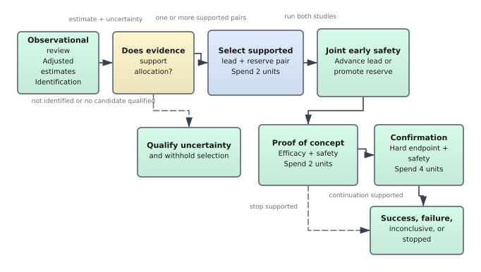
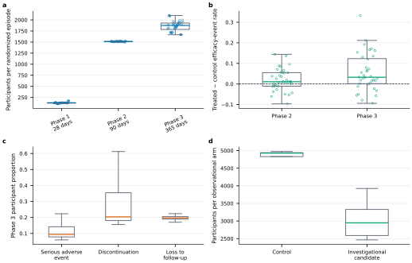
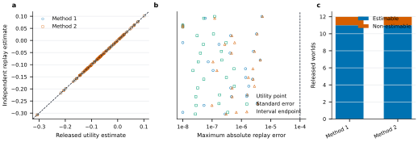
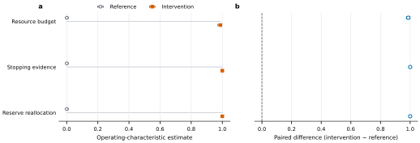
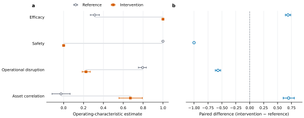
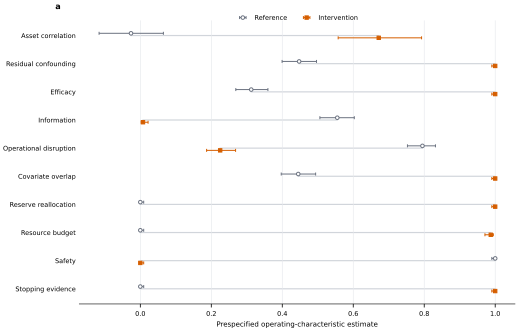
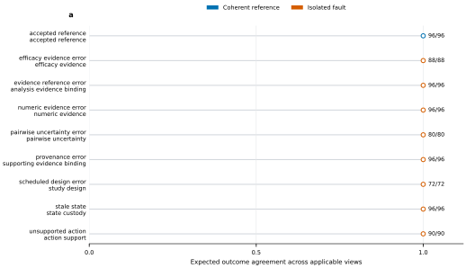
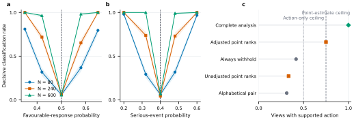
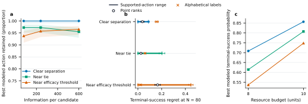
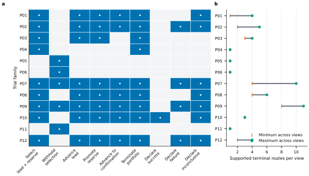

# TrialDev verification

TrialDev asks whether an analysis system can turn the evidence available at each stage of a clinical development programme into an identified statistical result, a supported decision, and a coherent programme history. The verification follows that chain directly: programme structure, clinical data, independent analysis, response to controlled changes, evaluation controls, and downstream consequences.

## Programme structure

The single-candidate programme has irreversible stage transitions. The portfolio programme adds a lead and reserve, a finite resource budget, and one possible reserve promotion after lead failure. Explicit terminal and nonprogression actions prevent an inconclusive analysis from being converted automatically into progression.

**Figure 1. Programme states and actions.** Nodes are reachable programme states and arrows are legal actions under the declared resource schedule. The graph is reconstructed from [state_action_graph.csv](results/state_action_graph.csv).

## Clinical data

The release contains 12 worlds, 96 objective-by-budget views, and 108 randomized episodes. The exact audit covers 165,660 observational and 126,002 randomized rows. Every world contains a control and three investigational candidates; randomized episodes compare one candidate with its concurrent control. The data census measures phase-specific sample size and follow-up, treatment contrasts, safety events, retention, and observational support.

**Figure 2. Clinical data structure.** Each panel reports a released, participant-visible property; points summarize episodes or worlds rather than design inputs. The panels show that later phases contain more participants and longer follow-up, while treatment effects, serious events, discontinuation, loss to follow-up, and observational support vary across programmes. Numerical values are in [randomized_episode_realism.csv](results/randomized_episode_realism.csv) and [observational_realism.csv](results/observational_realism.csv).

## Independent analysis

Independent replay passed for 12 world-level reports, covering both declared observational methods where estimable. The largest absolute discrepancy across utility, efficacy gain, standard error, interval endpoint, and pairwise contrast was 5.2e-06. Unsupported observational comparisons retain non-estimability rather than receiving a numerical substitute.

**Figure 3. Independent numerical reconstruction.** Released results and independent replays are shown on the same scale. Agreement demonstrates that the numerical results can be recovered from the released participant evidence; explicit non-estimability demonstrates that unsupported comparisons are not forced to produce an estimate. Source values are in [observational_replay.csv](results/observational_replay.csv).

## Controlled response

All 10 matched experiments changed their prespecified outcome in the expected direction, with 400 paired worlds per arm and no missing or failed worlds.

| Axis | Outcome | Reference | Intervention | Paired difference (95% interval) |
|---|---|---:|---:|---:|
| Efficacy | progression supported | 0.312 | 1.000 | 0.688 (0.640 to 0.735) |
| Safety | progression supported | 1.000 | 0.000 | -1.000 (-1.000 to -1.000) |
| Information | indeterminate | 0.555 | 0.007 | -0.547 (-0.598 to -0.497) |
| Confounding | withholding supported | 0.448 | 1.000 | 0.552 (0.502 to 0.600) |
| Overlap | withholding supported | 0.445 | 1.000 | 0.555 (0.505 to 0.603) |
| Operations | operational success | 0.795 | 0.225 | -0.570 (-0.618 to -0.522) |
| Asset Correlation | asset standardized cross product | -0.026 | 0.672 | 0.698 (0.601 to 0.799) |
| Resources | late promotion supported | 0.000 | 0.988 | 0.988 (0.975 to 0.998) |
| Stopping | stopping supported | 0.000 | 1.000 | 1.000 (1.000 to 1.000) |
| Reallocation | promotion supported | 0.000 | 1.000 | 1.000 (1.000 to 1.000) |

**Figure 4. Policy response.** Matched experiments isolate resource, stopping, and reallocation conditions while preserving the remaining programme state. Each intervention changes the corresponding programme decision in all paired worlds, showing that these controls have an observable consequence rather than serving as descriptive metadata.

**Figure 5. Mechanism response.** Efficacy, safety, information, confounding, overlap, operations, and cross-candidate dependence are changed one at a time. The resulting shifts occur in the intended clinical or analytical quantity; intervals use the paired world as the independent unit. Complete estimates are in [operating_characteristics.csv](results/operating_characteristics.csv).

**Figure 6. Operating characteristics.** Reference and intervention rates are shown with their uncertainty, so the intended direction, effect size, and sampling precision can be assessed separately across all ten controlled changes.

## Evaluation controls

The exact evaluation census contains 810 positive and isolated-fault controls. Reference submissions produced complete scientific grades; numeric, provenance, action, and design faults were isolated in their owning responsibilities, and stale states were rejected before grading.

**Figure 7. Evaluation controls.** Each point gives the exact agreement rate and denominator for one positive or single-fault control. Full records are in [grader_controls.csv](results/grader_controls.csv).

## Decision difficulty

Repeated-world boundary experiments show that evidence becomes more decisive as information increases away from the efficacy and safety thresholds, while evidence at the thresholds remains predominantly indeterminate. Across the exact 96 views, complete evidence-and-policy analysis is supported in every view; adjusted point ranking reaches 75.0%, always withholding reaches 41.7%, raw point ranking reaches 33.3%, and alphabetical selection reaches 31.2%.

**Figure 8. Decision difficulty.** Boundary cells show how information and distance from the efficacy or safety threshold change clear-pass, clear-fail, and indeterminate evidence. The released-view census compares complete analysis with prespecified uncertainty-blind strategies. Values are in [decision_boundary_cells.csv](results/decision_boundary_cells.csv) and [shortcut_strategies.csv](results/shortcut_strategies.csv).

## Decision consequences

Evidence may support more than one action, and those actions can lead to
different programme outcomes. The known programme probabilities give the
chance of successful programme completion for every supported action. The
analysis identifies the supported action with the highest probability and
measures how often the supported set retains it. These probabilities evaluate
the supported options; they are not an additional decision rule available to
the analysis system.

Across 7,200 simulated programmes, the terminal-success-maximising supported
action had mean terminal-success probability 0.712, compared with 0.656 for
adjusted point-estimate selection and 0.653 for selection by asset label.
All strategies operated under the same 8- or 10-unit resource budgets. Their
mean realised resource use was 7.164, 6.618, and 7.016 units, respectively.

| Decision rule | Mean terminal-success probability | Mean realised resource use |
|---|---:|---:|
| Terminal-success-maximising supported action | 0.712 | 7.164 |
| Adjusted point-estimate selection | 0.656 | 6.618 |
| Selection by asset label | 0.653 | 7.016 |

Across the prespecified grid, the lower 95% confidence bound for retaining the
terminal-success-maximising action is at least 90.9%. The largest mean gap
between the best and worst supported action is 0.613 in terminal-success
probability, showing why support and selection within the supported set remain
distinct. The 10-unit schedule increases terminal success by permitting a late
reserve switch after lead failure. Asset identities are permuted across
repeated worlds; the largest mean regret of alphabetical selection is 0.159,
so stable labels do not encode candidate quality.

**Figure 9. Decision consequences.** Reference-action coverage and terminal-success regret are reported across candidate separation, information size, and resource budget with Wilson or paired-bootstrap intervals. Numerical results are in [policy_value_cells.csv](results/policy_value_cells.csv).

## Supported programme routes

Exhaustive traversal evaluated 750 method-conditioned states and 327 terminal routes across all 96 released views. It reached all nine action types, all five checkpoints, and all five terminal dispositions. The census includes 10 joint safety-stop states, 66 early and 66 late reserve-promotion routes, and both identified and non-identified withholding controls.

**Figure 10. Supported programme routes.** The action matrix gives exact reachability by trial family; ranges give the minimum and maximum number of terminal routes across the eight objective-by-budget views of each family. Views sharing a world are not independent. Numerical values are in [portfolio_routes.csv](results/portfolio_routes.csv).

Together, these analyses establish that the released task contains recognizable clinical-development data, its declared analyses can be reproduced from participant evidence, controlled changes produce the intended statistical response, incomplete strategies leave material cases unresolved, and supported actions retain high-value options across the tested programme conditions.
